## 计算机毕业设计Hive+Spark空气质量预测 空气质量可视化 空气质量分析 空气质量爬虫 Hadoop 机器学习 深度学习 Django 大模型

## 要求
### 源码有偿！一套(论文 PPT 源码+sql脚本+教程)

### 
### 加好友前帮忙start一下，并备注github有偿Spark空气质量预测
### 我的QQ号是2827724252或者798059319或者 1679232425或者微信:bysj2023nb

# 

### 加qq好友说明（被部分 网友整得心力交瘁）：
    1.加好友务必按照格式备注
    2.避免浪费各自的时间！
    3.当“客服”不容易，repo 主是体面人，不爆粗，性格好，文明人。

## 介绍
技术栈：spark、hadoop、hive、mysql、requests、机器学习预测算法
## 演示视频
https://www.bilibili.com/video/BV1jnUYYEEVt/
## 运行截图
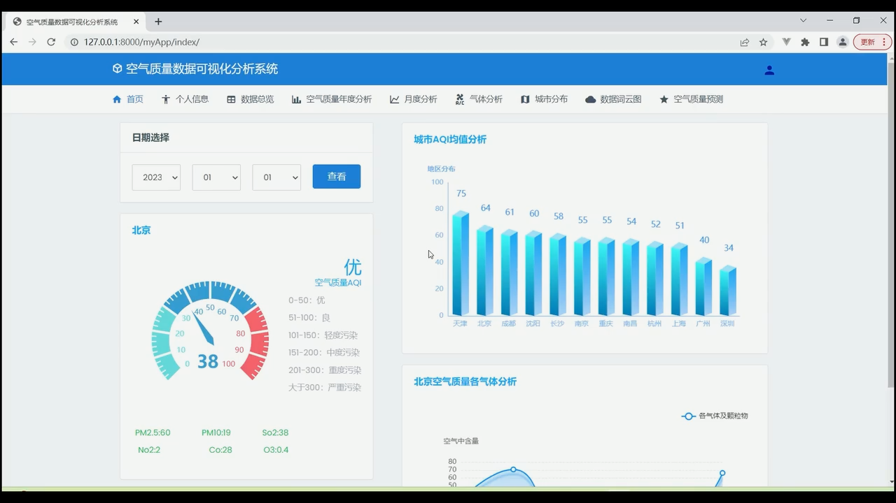
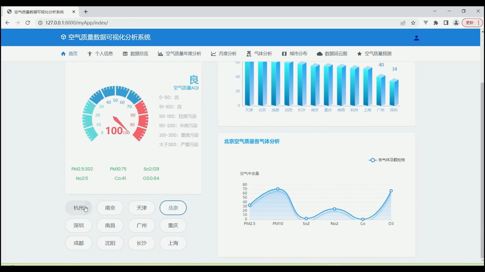

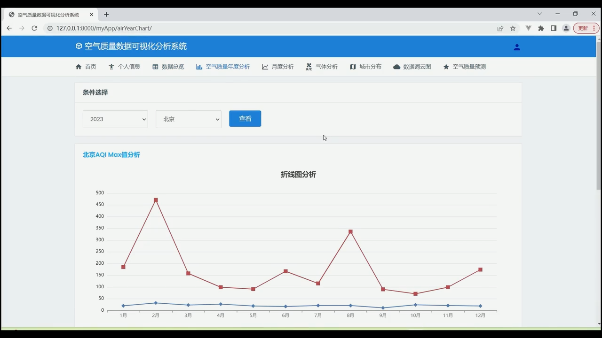
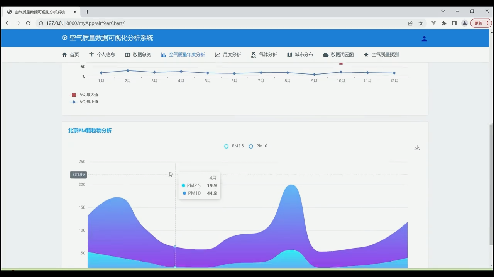
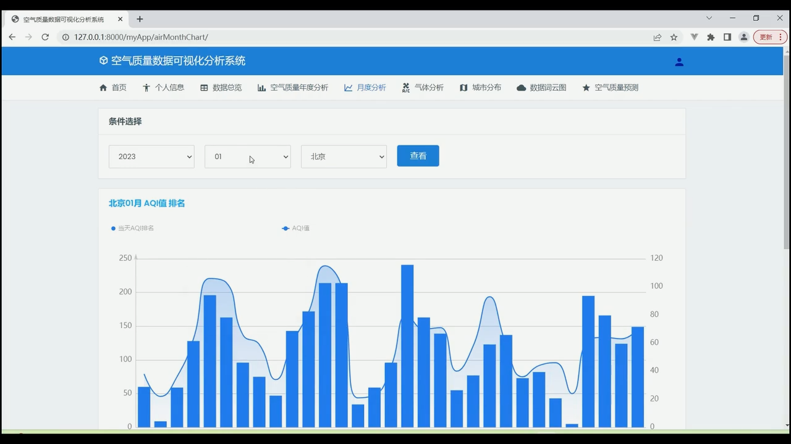
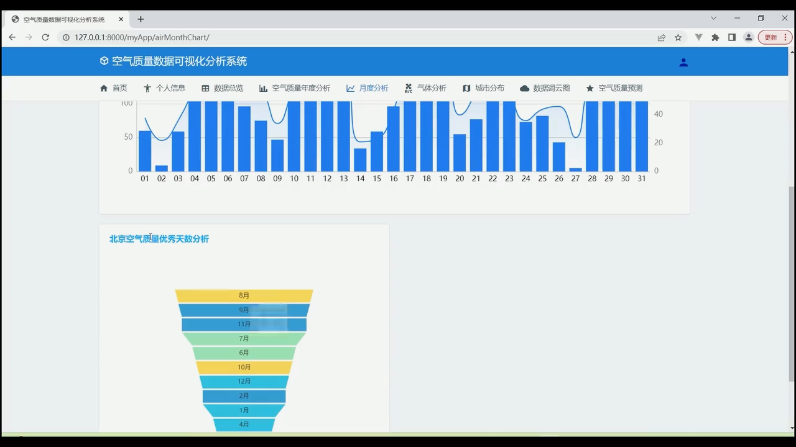
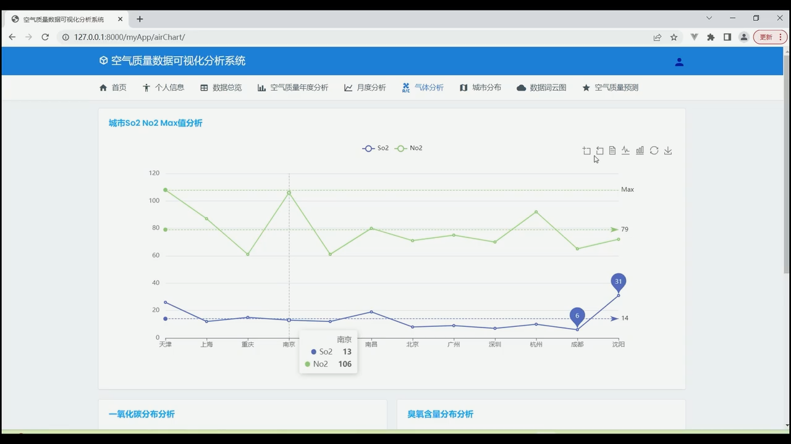

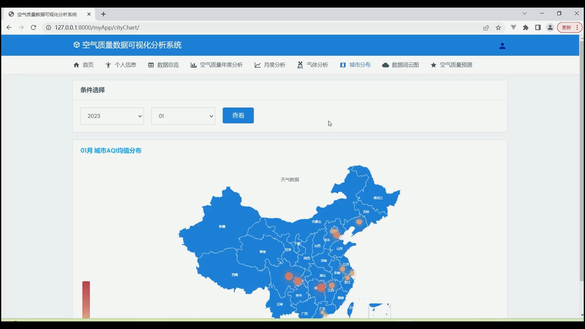
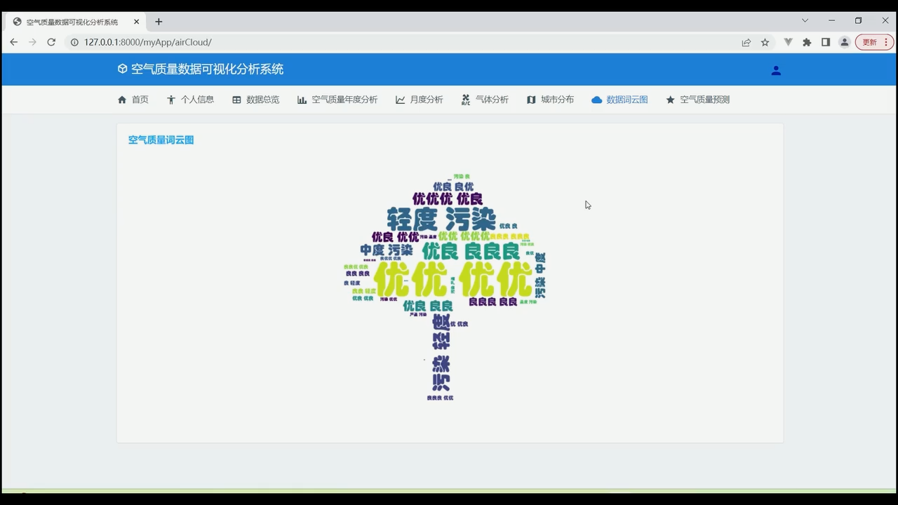
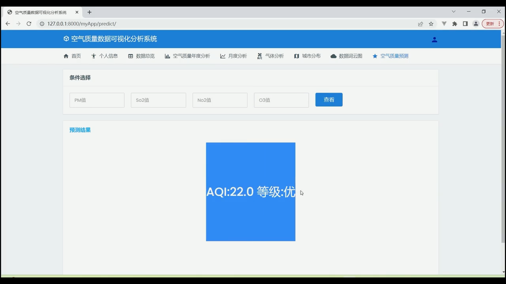
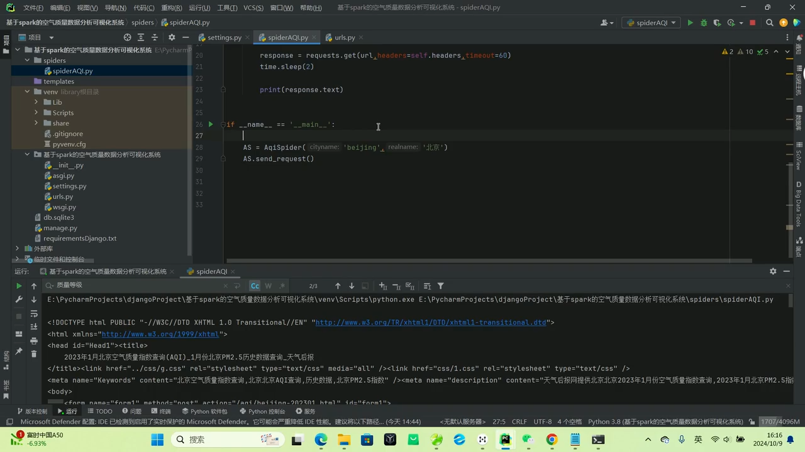
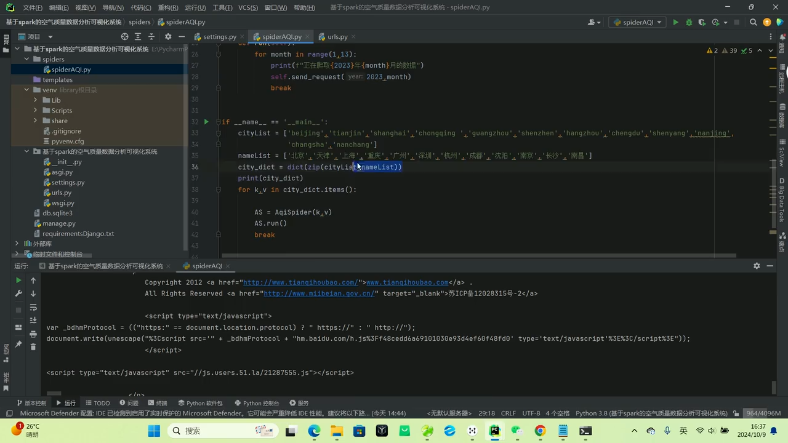
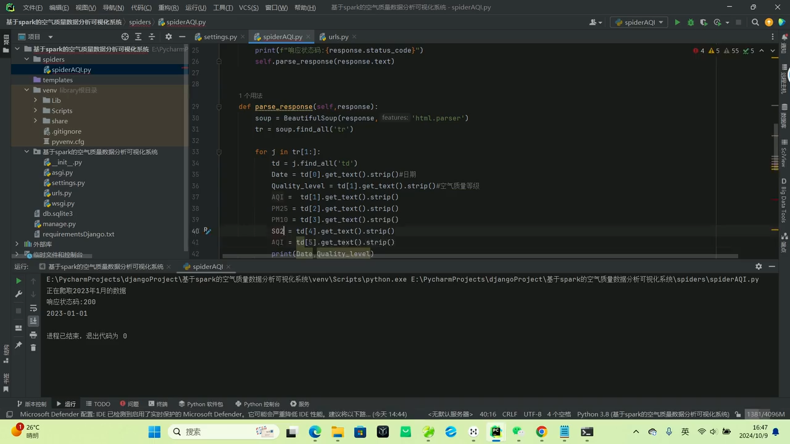

